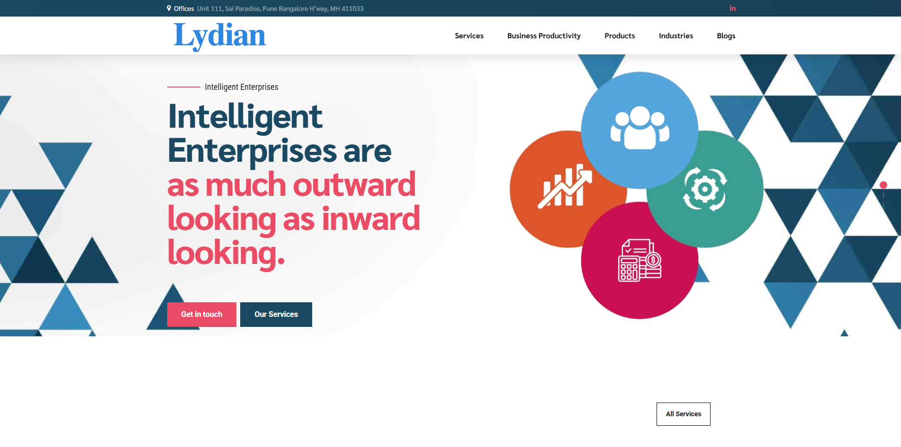

# LydianGBS

### 🏢 About the Client

**LydianGBS** is a business transformation consulting firm with a strong focus on technology-based solutions that automate and enhance organizational efficiency. Their services span from supply chain optimization to ERP system streamlining.

With a mission to simplify complex business problems, LydianGBS aimed to create a modern, dynamic web presence that effectively showcases their capabilities and appeals to a broader audience.

---
[Visit Us](https://lydiangbs.com)

---
### 🎯 Objectives

The goal was to build a business website that:

- Reflects LydianGBS's expertise in business transformation.
    
- Includes a user-friendly, functional e-commerce platform.
    
- Converts visitors into clients through clear, engaging service presentations.

---

### 🧑🏻‍💻 Technologies Used

- **PHP**: Server-side scripting for custom functionalities and database integration.
    
- **MySQL**: Database management system for client data, products, and services.
    
- **WordPress**: CMS for easy content updates and site maintenance.
    
- **WooCommerce**: E-commerce plugin for handling transactions of consulting packages and digital materials.
    
- **Elementor**: Page builder for responsive and visually appealing layouts.
    
- **Astra Theme**: Lightweight, customizable theme optimized for performance.

---

### 🚧 Challenges

1. **Clarity of Complex Services**
	Explaining services like supply chain revamps and ERP optimization without jargon or technical overload.

2. **User Experience Optimization**
	Creating a navigable, engaging site that encourages conversions through clear calls-to-action.

3. **E-Commerce Integration**
	Developing a seamless shopping experience for both physical services and digital products.

4. **Scalability & Performance**
	Ensuring fast load times and responsiveness across devices, with room for future growth.

---

### 💡Approach & Solution

- **Clear, Simple Messaging**

	We collaborated with LydianGBS to simplify their service descriptions, avoiding buzzwords and focusing on client challenges and outcomes.

	**Result**: Messaging clearly outlines how LydianGBS helps clients, making benefits easy to understand.
	
- **Design & User Experience**

	Using Elementor and Astra, we crafted a modern layout emphasizing simplicity and usability. Key services are featured on the homepage with intuitive navigation.

	**Outcome**: Reduced bounce rates and increased page engagement thanks to easier content discovery.

- **E-Commerce Integration**

	WooCommerce was integrated to allow purchase of consultations, workshops, and downloadable content. The checkout process is simple and secure, with account pages for purchase history and appointment management.

	**Outcome**: LydianGBS can now sell services online, reaching a wider audience and increasing revenue.

- **Performance & Scalability**

	The site is optimized for speed using caching and image compression. Built with scalability in mind to support future traffic and service expansion.

	**Result**: A fast, responsive website prepared for long-term growth.

---

### 📈 Results & Impact

- **🚀 Enhanced Client Conversion**: Improved messaging and design have boosted lead generation and customer inquiries.
    
- **💸 Increased Online Sales**: WooCommerce integration enables the online sale of consulting packages and digital products.
    
- **🌐 Greater Online Presence**: The new site elevates LydianGBS’s reputation as a modern, professional consulting leader.
